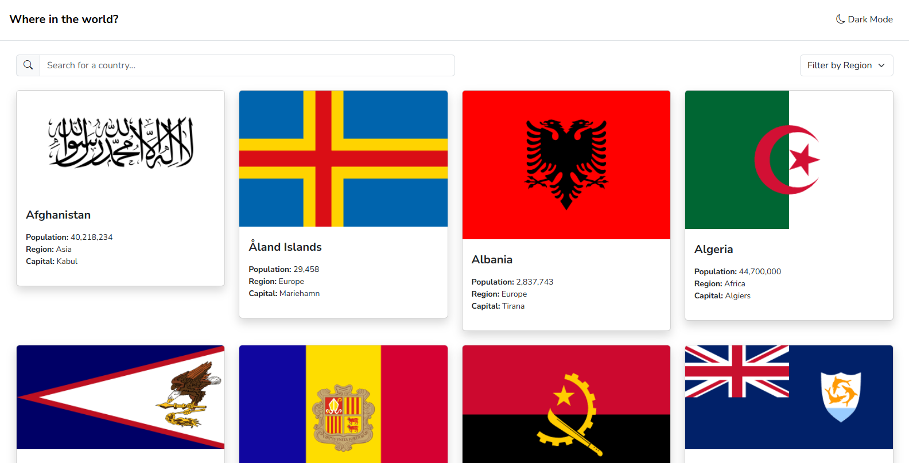

# Project 1: HTML, CSS, and JavaScript

[Karl Johnson](https://github.com/hirekarl)  
2025-RTT-30  
<time datetime="2025-07-17">2025-07-17</time>  

## Overview
### Viewer Instructions
Navigate to [`calm-monstera-1df2a6.netlify.app`](https://calm-monstera-1df2a6.netlify.app/).

### Submission Source
Top-level program behavior can be found in [`./src/index.ts`](./src/index.ts).

### Reflection
Write a 200-300 word reflection discussing your development process, challenges faced, solutions implemented, and potential improvements.
> I used Bootstrap to handle the layout and styling for this. At first, I was trying to match the design exactly, and I spent the whole first day trying to do so. In the end, I decided I'd rather work within what was intuitive for Bootstrap rather than try to get the spacing and colors exactly right. This time around, I compiled Bootstrap CSS from scratch with some customization, mainly to deal with the typography and hover states.
>
> I was initially using [a third-party library](https://www.npmjs.com/package/@yusifaliyevpro/countries) to better deal with the API calls, but I found that I wanted to get into the guts of the API calls myself. It took a lot of time to wrangle the TypeScript around the data, which I imagine would get better with practice. With an opportunity for a refactor, I may consider re-implementing the third-party library to better deal with the calls.
>
> I just learned about HTML templating for JavaScript. If I had known about it, I would have wrapped the country cards and the modal interiors in `<template>` tags rather than imperatively setting each dynamically created element and its associated attributes and classes by hand. There's certainly a lot of repetition in the code that could be deduplicated, and for sure some opportunities for performance improvements.
>
> As it stands, transitions (page load, modal show and hide, and region select) could use finessing. Page load and modal show in particular could benefit from some hiding of content until all items are loaded. With more time, I'd also try to match style spec items more exactly.

### Assignment

For this cumulative assessment on HTML, CSS, and JavaScript, you will select and complete one of the following [Frontend Mentor](]https://www.frontendmentor.io/)  challenges:

#### 3. [**REST Countries API with Color Theme Switcher**](https://www.frontendmentor.io/challenges/rest-countries-api-with-color-theme-switcher-5cacc469fec04111f7b848ca)
Develop an application that fetches data from the [REST Countries API](https://restcountries.com/) , displays country information, and includes a color theme switcher for light and dark modes.
- [Click here to download the starter files.](https://ps-lms.vercel.app/curriculum-assets/414/rest-countries-api-with-color-theme-switcher-master.zip)

The code, briefs, and images for each challenge are included within this module as well, for reference. You should use the material included with this module, just in case the challenges changes in scope or

This project aims to assess your ability to apply the skills and knowledge acquired throughout the course in a practical, real-world scenario. Choose the challenge that best aligns with your interests and strengths, and demonstrate your proficiency in front-end development.

##### Brief
If you are wanting to test your JavaScript skills this is the challenge for you. Use whichever JS framework you prefer and pull data from the REST Countries API.

Your challenge is integrating with the [REST Countries API ](https://restcountries.com/) to pull country data and display it like in the designs.

You have complete control over which packages you use to make HTTP requests or style your project.

Your users should be able to:
- See all countries from the API on the homepage
- Search for a country using an input field
- Filter countries by region
- Click on a country to see more detailed information on a - separate page
- Click through to the border countries on the detail page
- View the optimal layout for the interface depending on their - device’s screen size
- See hover and focus states for all interactive elements on the - page
- **Bonus**: Toggle the color scheme between light and dark mode

Download the starter code and go through the `README.md` file. This will provide further details about the project. The `style-guide.md` file is where you will find colors, fonts, etc.